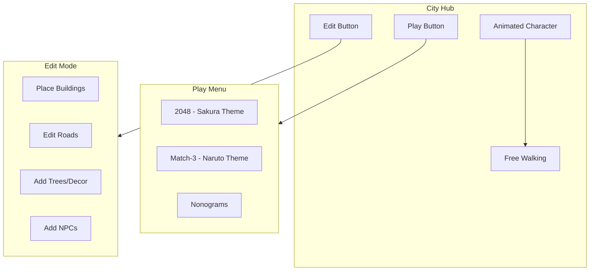

# Arcade City - Expanded Development Plan

## Vision Summary

Transform Arcade City from a minimal Apple-style PWA into a rich, themed game experience featuring:
- Animated player character (DragonBones) with customizable clothing/accessories
- City hub where the character walks freely
- Distinct visual themes per game mode (anime/Naruto-style Match-3, Sakura 2048, etc.)
- Edit mode for city customization (buildings, roads, trees, NPCs)

---

## New Feature Overview



---

## Phase 0: Character Creator (HIGH PRIORITY)

This is the first thing players see. Must establish player identity before anything else.

### Existing Assets
You have DragonBones assets in [assets_char/](assets_char/):
- `body/` - Base character body with `body.dbproj`
- `suit1/` and `suit2/` - Clothing/accessory options

### Implementation Steps

| Step | Description | Complexity |
|------|-------------|------------|
| 0.1 | Integrate DragonBones runtime (pixi-dragonbones or dragonbones-pixi) | Medium |
| 0.2 | Create CharacterManager class to load/swap body + clothing layers | Medium |
| 0.3 | Build Character Creator UI overlay (select face, hair, skin, outfit) | Medium |
| 0.4 | Persist character config to localStorage (`arcadeCityCharacter`) | Low |
| 0.5 | Display character in city hub with idle/walk animations | Medium |
| 0.6 | Add wardrobe/shop for purchasing new clothing items | Medium |

### New Files to Create
- `src/core/CharacterManager.js` - DragonBones loading, layer management
- `src/components/CharacterCreator.js` - Creator UI overlay
- `src/components/CharacterSprite.js` - PixiJS wrapper for DragonBones armature

### Key Decisions Needed
1. Which DragonBones runtime version? (recommend `dragonbones-pixi` for PixiJS v8)
2. How many starting outfit options? (suggest 3-5 free, rest purchasable)
3. Character walk speed and animation states (idle, walk, run?)

---

## Phase 1: City Hub Redesign

Transform city from isometric builder into character hub with floating UI.

### Current State
- [src/games/city/CityScene.js](src/games/city/CityScene.js) - Isometric PixiJS renderer
- Place/Erase modes exist but no character walking

### Changes Required

| Change | Description |
|--------|-------------|
| Add player character | Spawn CharacterSprite in city, follow with camera |
| Walking controls | Tap-to-move or virtual joystick |
| Floating UI buttons | Play button (opens game menu), Edit button (opens edit mode) |
| Edit mode | Existing place/erase but with new UI overlay |
| Camera follow | Smooth camera tracking of player character |

### UI Layout (City View)
```
+----------------------------------+
|  [Coins]              [Settings] |
|                                  |
|                                  |
|        (City + Character)        |
|                                  |
|                                  |
|  [Edit]                  [Play]  |
+----------------------------------+
```

---

## Phase 2: UI Theme System

Each game mode gets a distinct visual theme with custom:
- Background art
- Frame/border decorations
- Button styles
- Gem/tile sprites (for Match-3)
- Sound effects (future)

### Theme Structure

```
public/assets/themes/
├── sakura/          # 2048 theme
│   ├── background.jpg
│   ├── frame.png
│   ├── tiles/       # 2, 4, 8... tile images
│   └── ui/          # buttons, panels
├── naruto/          # Match-3 theme
│   ├── background.jpg
│   ├── frame.png
│   ├── gems/        # kunai, scroll, shuriken...
│   └── ui/
└── silent-hill/     # Match-3 alt theme
    └── ...
```

### Implementation

| Step | Description |
|------|-------------|
| 2.1 | Create ThemeConfig interface (paths, colors, sounds) |
| 2.2 | Add theme loader to each game module |
| 2.3 | Replace current Kenney assets with themed sprites |
| 2.4 | Add decorative frame rendering around game board |
| 2.5 | Create Play Menu overlay showing available themes |
| 2.6 | Unlock system - some themes locked until purchased/earned |

### Play Menu Design (like screenshot 4)
- Shows game categories: 2048, Match-3, Nonograms
- Each category shows available themes/worlds
- Locked themes show lock icon + unlock requirements

---

## Phase 3: Remaining Original Roadmap Items

These items from the original plan still apply:

| Item | Status | Priority |
|------|--------|----------|
| Shop wiring (inventory persistence) | Pending | High - needed for character clothes |
| Audio system (Howler.js) | Pending | Medium |
| Picross/Nonograms game | Pending | Medium |
| PWA caching for assets | Pending | Low |
| Firestore index | Pending | Low |

---

## Revised Priority Order

```mermaid
gantt
    title Development Priority
    dateFormat X
    axisFormat %s
    
    section Phase0
    DragonBones Integration    :p0a, 0, 2
    Character Creator UI       :p0b, after p0a, 2
    Character in City          :p0c, after p0b, 1
    
    section Phase1
    City Walking Controls      :p1a, after p0c, 1
    Floating UI Buttons        :p1b, after p1a, 1
    Edit Mode Redesign         :p1c, after p1b, 2
    
    section Phase2
    Theme Config System        :p2a, after p1c, 1
    Sakura 2048 Theme          :p2b, after p2a, 2
    Naruto Match3 Theme        :p2c, after p2b, 2
    Play Menu UI               :p2d, after p2c, 1
    
    section Phase3
    Shop Persistence           :p3a, after p0a, 1
    Audio Integration          :p3b, after p2d, 2
    Picross Game               :p3c, after p2d, 3
```



### Sprint Breakdown

**Sprint 1: Character Foundation**
- Integrate DragonBones runtime
- Build CharacterManager
- Character Creator overlay
- Save/load character config

**Sprint 2: City Hub**
- Add character to city
- Tap-to-walk movement
- Camera follow
- Play/Edit floating buttons

**Sprint 3: Theme System**
- Theme configuration structure
- Sakura theme for 2048
- Naruto theme for Match-3
- Play Menu overlay

**Sprint 4: Polish**
- Additional themes
- Audio integration
- Unlock/purchase system
- Picross game mode

---

## Technical Considerations

### DragonBones Integration
- Use `dragonbones-pixi` package (npm)
- Compatible with PixiJS v8
- Assets need export from DragonBones Pro in JSON format

### Performance
- Lazy-load theme assets per game
- Character animations should use sprite sheets, not frame-by-frame
- Consider texture atlases for themed UI elements

### Asset Requirements
You'll need to source/create:
- Themed backgrounds and frames for each game mode
- Themed gem/tile sprites
- UI button variations per theme
- Walking animation frames for character (if not in existing DragonBones assets)

---

## TODO Checklist

- [x] ~~**dragonbones-setup**~~ - Using PixiJS sprites (DragonBones deferred until proper skeleton exports available)
- [x] **character-manager** - CharacterManager class with skin tone, hair style, hair color
- [x] **character-creator-ui** - Character Creator overlay with live PixiJS preview
- [x] **character-persistence** - Saves to localStorage (`arcadeCityCharacter`)
- [x] **city-character** - Character displays in city with idle/walk animations
- [x] **city-walking** - Tap-to-walk movement with smooth camera follow
- [x] **city-floating-ui** - Floating buttons: Play, Edit, Shop, Style (Wardrobe)
- [x] **play-menu** - Play Menu shows 2048, Match-3, Nonograms (locked)
- [x] **wardrobe-ui** - Wardrobe overlay for changing character appearance
- [x] **back-navigation** - "← City" button in all game headers
- [ ] **city-kenney-assets** - Add trees and buildings from Kenney isometric pack
- [ ] **theme-system** - Create theme configuration system for per-game theming
- [ ] **sakura-theme** - Implement Sakura/Japanese theme for 2048
- [ ] **naruto-theme** - Implement Naruto theme for Match-3
- [ ] **shop-persistence** - Wire shop purchases to inventory persistence
- [ ] **audio-system** - Integrate Howler.js for themed sound effects

---

## Latest Status (2026-01-22)

### Completed
| Feature | Description |
|---------|-------------|
| Character Creator | First-launch overlay, skin/hair customization |
| Character in City | Walking sprite with idle/walk animations |
| City Hub | Floating buttons (Play, Edit, Shop, Style) |
| Play Menu | Game selection overlay (2048, Match-3) |
| Wardrobe | Change appearance anytime via Style button |
| Navigation | Removed navbar, city is hub, back buttons in games |

### City Assets Analysis Complete
- Kenney Isometric City pack analyzed - it's a **road/terrain kit**, not a buildings kit
- Correct tree tiles identified: cityTiles_067, 075, 083, 036
- Using original custom buildings (house.png, building_*.png) for structures
- Starter city updated with proper asset mapping

### Next Up
- Per-game theme system (Sakura 2048, Naruto Match-3)
- Shop/inventory integration for clothes
- Source proper building assets (current Kenney pack lacks detailed buildings)
